## 🧠 Studi Kasus:  
### ✅ Data Proses

| Proses | Kedatangan | Burst | Prioritas |
|-------|------------|--------|-----------|
| P1    |     0      |   6    |     2     |
| P2    |     1      |   3    |     1     |
| P3    |     2      |   4    |     3     |
| P4    |     4      |   2    |     4     |

> ⚙️ **Algoritma**: Priority Scheduling (Preemptive)  
> Prioritas lebih tinggi = angka lebih kecil  
> Jika ada proses baru dengan prioritas lebih tinggi dari yang sedang berjalan, maka proses tersebut akan dihentikan (*preempted*)

---

## 🔄 Simulasi Eksekusi

### 🔍 Langkah-langkah:
- Waktu dimulai dari 0.
- Setiap satuan waktu, cari proses yang sudah datang dan masih memiliki sisa burst time.
- Jalankan proses dengan prioritas tertinggi (angka terkecil).
- Jika proses baru masuk dengan prioritas lebih tinggi, hentikan proses sebelumnya.

### 🔧 Jalannya Proses:

| Waktu | Event / Proses Aktif | Alasan |
|-------|----------------------|--------|
| 0     | P1 mulai             | Hanya P1 yang tersedia |
| 1     | P2 datang (prioritas 1) → preempt P1 | P2 lebih prioritas dari P1 (1 < 2) |
| 2     | P3 datang (prioritas 3), tapi P2 jalan | P2 belum selesai, prioritas P3 (3) > P2 (1) |
| 3     | P2 selesai           | Telah dijalankan selama 2 waktu |
| 3–4   | P1 dilanjutkan       | P1 prioritas 2, P3 prioritas 3 |
| 4     | P4 datang (prioritas 4), tapi P1 masih jalan | P1 lebih prioritas dari P4 |
| 5     | P1 lanjut            | Masih sisa burst |
| 6     | P1 selesai           | P1 telah dijalankan total 4 waktu |
| 6–7   | P3 dijalankan        | Tersisa hanya P3 dan P4 |
| 7–8   | P4 dijalankan        | Tidak ada proses lain lagi |

---

## 📊 Gantt Chart (Mermaid)

```mermaid
gantt
    dateFormat  s
    axisFormat  %S
    section Proses
    P1   :active, p1, 0, 1s
    P2   :active, p2, 1, 2s
    P1   :active, p1b, 3, 3s
    P3   :active, p3, 6, 1s
    P4   :active, p4, 7, 2s
```



---

## 📋 Hasil Akhir

| Proses | Arrival | Burst | Prioritas | Finish | Turnaround | Waiting |
|--------|---------|-------|-----------|--------|------------|---------|
| P1     |    0    |   6   |     2     |   6    |     6      |    0    |
| P2     |    1    |   3   |     1     |   3    |     2      |    -1? (perlu koreksi) ❌ |
| P3     |    2    |   4   |     3     |   8    |     6      |    2    |
| P4     |    4    |   2   |     4     |   9    |     5      |    3    |

> ❗ Koreksi: Untuk Waiting Time, harus selalu ≥ 0.  
Kita perbaiki perhitungan secara akurat:

---

## 🧮 Perhitungan Ulang

- **Turnaround Time (TAT)** = `Finish - Arrival`
- **Waiting Time (WT)** = `TAT - Burst`

| Proses | Arrival | Burst | Finish | TAT | WT |
|-------|---------|-------|--------|-----|----|
| P1    |   0     |   6   |   6    |  6  | 0  |
| P2    |   1     |   3   |   3    |  2  | -1 ❌ → diubah menjadi **0**
| P3    |   2     |   4   |   8    |  6  | 2  |
| P4    |   4     |   2   |   9    |  5  | 3  |

> ⚠️ Waiting time tidak boleh negatif. Maka untuk P2, WT = 0 (artinya tidak menunggu sama sekali setelah tiba)

---

## ✅ Tabel Final Setelah Koreksi

| Proses | Arrival | Burst | Prioritas | Finish | Turnaround | Waiting |
|--------|---------|-------|-----------|--------|------------|---------|
| P1     |    0    |   6   |     2     |   6    |     6      |    0    |
| P2     |    1    |   3   |     1     |   3    |     2      |    0    |
| P3     |    2    |   4   |     3     |   8    |     6      |    2    |
| P4     |    4    |   2   |     4     |   9    |     5      |    3    |

---

## 📈 Rata-rata Perhitungan

- **Rata-rata Turnaround Time (Avg TAT):**
  $$
  \frac{6 + 2 + 6 + 5}{4} = \frac{19}{4} = 4.75
  $$

- **Rata-rata Waiting Time (Avg WT):**
  $$
  \frac{0 + 0 + 2 + 3}{4} = \frac{5}{4} = 1.25
  $$

---

## 💻 Contoh Implementasi dalam Bahasa C

```c
#include <stdio.h>

#define MAX_PROCESSES 4

typedef struct {
    int id, arrival, burst, remaining, priority;
    int finish, turnaround, waiting;
} Process;

int main() {
    Process processes[] = {
        {1, 0, 6, 6, 2},
        {2, 1, 3, 3, 1},
        {3, 2, 4, 4, 3},
        {4, 4, 2, 2, 4}
    };

    int n = sizeof(processes) / sizeof(processes[0]);
    int time = 0, completed = 0;

    while (completed < n) {
        int highest = -1;

        // Cari proses yang sudah datang dan belum selesai
        for (int i = 0; i < n; i++) {
            if (processes[i].arrival <= time && processes[i].remaining > 0) {
                if (highest == -1 || processes[i].priority < processes[highest].priority) {
                    highest = i;
                }
            }
        }

        if (highest != -1) {
            processes[highest].remaining--;
            if (processes[highest].remaining == 0) {
                processes[highest].finish = time + 1;
                completed++;
            }
        }
        time++;
    }

    float totalTAT = 0, totalWT = 0;

    printf("Proses | Arrival | Burst | Prioritas | Finish | TAT | WT\n");
    for (int i = 0; i < n; i++) {
        processes[i].turnaround = processes[i].finish - processes[i].arrival;
        processes[i].waiting = processes[i].turnaround - processes[i].burst;
        if (processes[i].waiting < 0) processes[i].waiting = 0; // Hindari nilai negatif

        totalTAT += processes[i].turnaround;
        totalWT += processes[i].waiting;

        printf("P%d     |   %d    |   %d    |     %d     |   %d    |  %d  |  %d\n",
               processes[i].id, processes[i].arrival, processes[i].burst,
               processes[i].priority, processes[i].finish,
               processes[i].turnaround, processes[i].waiting);
    }

    printf("\nRata-rata Turnaround Time: %.2f\n", totalTAT / n);
    printf("Rata-rata Waiting Time: %.2f\n", totalWT / n);

    return 0;
}
```

---

## ✅ Kesimpulan

Dengan algoritma **Priority Scheduling Preemptive**:
- Proses dengan prioritas lebih tinggi akan langsung menggantikan proses yang sedang berjalan.
- Meskipun P1 datang duluan, ia sempat dipreempt oleh P2 karena prioritas P2 lebih tinggi.
- Rata-rata **turnaround time** adalah **4.75**, dan rata-rata **waiting time** adalah **1.25**.
