# Scheduling Algorithms

## Overview
Algoritma penjadwalan CPU sangat penting untuk manajemen proses yang efisien dalam sistem operasi. Algoritma ini menentukan proses mana yang akan dijalankan pada waktu tertentu untuk mengoptimalkan kinerja sistem.

## SJF (Shortest Job First)
#### Description
- SJF adalah algoritma penjadwalan non-preemptive
- Proses dieksekusi berdasarkan waktu burst terpendek ke terpanjang
- Cocok untuk sistem batch dimana waktu burst diketahui sebelumnya
- Mengurangi waktu tunggu rata-rata dibandingkan FCFS

#### Code SJF (Shortest Job First) Without Arrival time (non preemtive)

```c

#include <stdio.h>
struct proc
{
    int no,bt,ct,tat,wt;
};
struct proc read(int i)
{
    struct proc p;
    printf("\nProcess No: %d\n",i);
    p.no=i;
    printf("Enter Burst Time: ");
    scanf("%d",&p.bt);
    return p;
}
int main()
{
    struct proc p[10],tmp;
    float avgtat=0,avgwt=0;
    int n,ct=0;
    printf("<--SJF Scheduling Algorithm Without Arrival Time (Non-Preemptive)-->\n");
    printf("Enter Number of Processes: ");
    scanf("%d",&n);
    for(int i=0;i<n;i++)
        p[i]=read(i+1);
    for(int i=0;i<n-1;i++)
        for(int j=0;j<n-i-1;j++)    
            if(p[j].bt>p[j+1].bt)
            {
				tmp=p[j];
				p[j]=p[j+1];
				p[j+1]=tmp;
            }
    printf("\nProcessNo\tBT\tCT\tTAT\tWT\tRT\n");
    for(int i=0;i<n;i++)
    {
        ct+=p[i].bt;
		p[i].ct=p[i].tat=ct;
		avgtat+=p[i].tat;
        p[i].wt=p[i].tat-p[i].bt;
        avgwt+=p[i].wt;
        printf("P%d\t\t%d\t%d\t%d\t%d\t%d\n",p[i].no,p[i].bt,p[i].ct,p[i].tat,p[i].wt,p[i].wt);
    }
    avgtat/=n,avgwt/=n;
    printf("\nAverage TurnAroundTime=%f\nAverage WaitingTime=%f",avgtat,avgwt);
}

```

#### Output 
---

```

Masukkan jumlah proses: 4

Burst Time
P1 =5
P2 =7
P3 =4
P4 =2

```


### Hasil Output Program 
| Prosses 	| Burst Time (BT) 	| Completion Time (CT) 	| Turn Arround Time (TAT) 	| Waiting TIme (WT) 	| Response Time (RT) 	|
|---------	|-----------------	|----------------------	|-------------------------	|------------------:	|--------------------	|
| P4      	| 2               	| 2                    	| 2                       	| 0                 	| 0                  	|
| P3      	| 4               	| 6                    	| 6                       	| 2                 	| 2                  	|
| P1      	| 5               	| 11                   	| 11                      	| 6                 	| 6                  	|
| P2      	| 7               	| 18                   	| 18                      	| 11                	| 11                 	|

---


---
#### Perhitungan Turn Around Time
```

TAT = Completion Time - Arrival Time
(Karena arrival time = 0 untuk semua proses)

P4: TAT = 2 - 0 = 2
P3: TAT = 6 - 0 = 6 
P1: TAT = 11 - 0 = 11
P2: TAT = 18 - 0 = 18

Average TAT = (2 + 6 + 11 + 18) / 4 = 9.25

```
---
#### Perhitungan Waiting Time
```
WT = Turn Around Time - Burst Time

P4: WT = 2 - 2 = 0
P3: WT = 6 - 4 = 2
P1: WT = 11 - 5 = 6
P2: WT = 18 - 7 = 11

Average WT = (0 + 2 + 6 + 11) / 4 = 4.75

```
---
#### Perhitungan Response Time

```
RT = First Response - Arrival Time
(Dalam kasus non-preemptive, RT = WT)

P4: RT = 0
P3: RT = 2
P1: RT = 6
P2: RT = 11

Average RT = (0 + 2 + 6 + 11) / 4 = 4.75
```
---
### GANTT CHART


---
#### Perhitungan Rata - Rata

```

Average Turn Around Time = (2 + 6 + 11 + 18) / 4 = 9.25
Average Waiting Time = (0 + 2 + 6 + 11) / 4 = 4.75
Average Response Time = (0 + 2 + 6 + 11) / 4 = 4.75

```
---

---
#### Analisa

```

- Proses dieksekusi berdasarkan burst time terpendek tanpa mempertimbangkan waktu kedatangan
- P4 (BT=2) dieksekusi pertama karena memiliki burst time terkecil
- Menghasilkan waktu tunggu yang optimal karena proses pendek didahulukan
- Response time sama dengan waiting time karena non-preemptive
- Cocok untuk sistem batch dengan proses yang diketahui burst time-nya di awal
- Kekurangan: Tidak mempertimbangkan waktu kedatangan proses

```

---

### Code SJF (Shortest Job First) With Arrival time (non preemtive)

```c

#include <stdio.h>
struct proc
{
    int no,at,bt,it,ct,tat,wt;
};
struct proc read(int i)
{
    struct proc p;
    printf("\nProcess No: %d\n",i);
    p.no=i;
    printf("Enter Arrival Time: ");
    scanf("%d",&p.at);
    printf("Enter Burst Time: ");
    scanf("%d",&p.bt);
    return p;
}
int main()
{
    int  n,j,min=0;
    float avgtat=0,avgwt=0;
    struct proc p[10],temp;
    printf("<--SJF Scheduling Algorithm (Non-Preemptive)-->\n");
    printf("Enter Number of Processes: ");
    scanf("%d",&n);
    for(int i=0;i<n;i++)
        p[i]=read(i+1);
    for(int i=0;i<n-1;i++)
        for(j=0;j<n-i-1;j++)    
            if(p[j].at>p[j+1].at)
            {
            temp=p[j];
            p[j]=p[j+1];
            p[j+1]=temp;
            }
    for(j=1;j<n&&p[j].at==p[0].at;j++)
        if(p[j].bt<p[min].bt)
            min=j;
    temp=p[0];
    p[0]=p[min];
    p[min]=temp;
    p[0].it=p[0].at;
    p[0].ct=p[0].it+p[0].bt;
    for(int i=1;i<n;i++)
    {
        for(j=i+1,min=i;j<n&&p[j].at<=p[i-1].ct;j++)
            if(p[j].bt<p[min].bt)
                min=j;
        temp=p[i];
        p[i]=p[min];
        p[min]=temp;
        if(p[i].at<=p[i-1].ct)
            p[i].it=p[i-1].ct;
        else
            p[i].it=p[i].at;
        p[i].ct=p[i].it+p[i].bt;
    }
    printf("\nProcess\t\tAT\tBT\tCT\tTAT\tWT\tRT\n");
    for(int i=0;i<n;i++)
    {
        p[i].tat=p[i].ct-p[i].at;
        avgtat+=p[i].tat;
        p[i].wt=p[i].tat-p[i].bt;
        avgwt+=p[i].wt;
        printf("P%d\t\t%d\t%d\t%d\t%d\t%d\t%d\n",p[i].no,p[i].at,p[i].bt,p[i].ct,p[i].tat,p[i].wt,p[i].wt);
    }
    avgtat/=n,avgwt/=n;
    printf("\nAverage TurnAroundTime=%f\nAverage WaitingTime=%f",avgtat,avgwt);
}

```

#### Output 
---

```

Masukkan jumlah proses: 4

Burst Time
P1 = 4
P2 = 5
P3 = 7
P4 = 3

Arrival Time
P1 = 3
P2 = 2
P3 = 6
P4 = 1
```


#### Hasil Output Program 
| Prosses 	| Arival Time (AT) 	| Burst Time (BT) 	| Completion Time (CT) 	| Turn Arround Time (TAT) 	| Waiting TIme (WT) 	| Response Time (RT) 	|
|---------	|------------------	|-----------------	|----------------------	|-------------------------	|------------------:	|--------------------	|
| P4      	| 1                	| 3               	| 4                    	| 3                       	| 0                 	| 0                  	|
| P1      	| 3                	| 4               	| 8                    	| 5                       	| 1                 	| 1                  	|
| P2      	| 2                	| 5               	| 13                   	| 11                      	| 6                 	| 6                  	|
| P3      	| 6                	| 7               	| 20                   	| 14                      	| 7                 	| 7                  	|
---


---
#### Perhitungan Turn Around Time

```
TAT = Completion Time - Arrival Time

P4: TAT = 4 - 1 = 3
P1: TAT = 8 - 3 = 5
P2: TAT = 13 - 2 = 11
P3: TAT = 20 - 6 = 14

Average TAT = (3 + 5 + 11 + 14) / 4 = 8.25
```

---
#### Perhitungan Waiting Time

```
WT = Turn Around Time - Burst Time

P4: WT = 3 - 3 = 0
P1: WT = 5 - 4 = 1
P2: WT = 11 - 5 = 6
P3: WT = 14 - 7 = 7

Average WT = (0 + 1 + 6 + 7) / 4 = 3.5
```

---
#### Perhitungan Response Time

```
RT = First Response - Arrival Time
(Dalam kasus non-preemptive, RT = WT)

P4: RT = 0
P1: RT = 1
P2: RT = 6
P3: RT = 7

Average RT = (0 + 1 + 6 + 7) / 4 = 3.5
```

---
#### GANTT CHART

```mermaid

gantt
    title Gantt Chart - SJF Non-Preemptive Scheduling
    dateFormat HH:mm
    axisFormat %H:%M
    section Eksekusi Proses
    P4 :p4, 01:00, 3h
    P1 :p1, after p4, 4h
    P2 :p2, after p1, 5h
    P3 :p3, after p2, 7h


```


---
#### Perhitungan Rata - Rata

```

Average Turn Around Time = (3 + 5 + 11 + 14) / 4 = 8.25
Average Waiting Time = (0 + 1 + 6 + 7) / 4 = 3.5
Average Response Time = (0 + 1 + 6 + 7) / 4 = 3.5

```


---
#### Analisa

```

- Mempertimbangkan arrival time dalam penjadwalan
- P4 dieksekusi pertama karena arrival time paling awal (t=1) dengan burst time pendek
- Menghasilkan rata-rata waktu tunggu lebih baik dari versi tanpa arrival time
- Lebih realistis untuk sistem nyata karena mempertimbangkan waktu kedatangan
- Response time sama dengan waiting time karena sifat non-preemptive
- Kekurangan: Masih bisa terjadi starvation pada proses dengan burst time panjang

```
---


## SRTF (Shortest Remaining Time First)
#### Description

- SRTF adalah versi preemptive dari SJF
- Proses yang sedang berjalan dapat diinterupsi jika ada proses baru yang lebih pendek
- Lebih optimal dari SJF tetapi lebih kompleks implementasinya
- Memerlukan monitoring berkelanjutan terhadap sisa waktu proses

#### Code SRTF (Shortest Remaining Time First) (preemtive)
```c

#include<stdio.h>
#define MAX 9999
struct proc
{
    int no,at,bt,rt,ct,tat,wt;
};
struct proc read(int i)
{
    struct proc p;
    printf("\nProcess No: %d\n",i);
    p.no=i;
    printf("Enter Arrival Time: ");
    scanf("%d",&p.at);
    printf("Enter Burst Time: ");
    scanf("%d",&p.bt);
    p.rt=p.bt;
    return p;
}
int main()
{
    struct proc p[10],temp;
    float avgtat=0,avgwt=0;
    int n,s,remain=0,time;
    printf("<--SRTF Scheduling Algorithm (Preemptive)-->\n");
    printf("Enter Number of Processes: ");
    scanf("%d",&n);
    for(int i=0;i<n;i++)
        p[i]=read(i+1);
    for(int i=0;i<n-1;i++)
        for(int j=0;j<n-i-1;j++)    
            if(p[j].at>p[j+1].at)
            {
            temp=p[j];
            p[j]=p[j+1];
            p[j+1]=temp;
            }
    printf("\nProcess\t\tAT\tBT\tCT\tTAT\tWT\n");
    p[9].rt=MAX;
    for(time=0;remain!=n;time++)
    {
        s=9;
        for(int i=0;i<n;i++)
            if(p[i].at<=time&&p[i].rt<p[s].rt&&p[i].rt>0)
                s=i;
        p[s].rt--;
        if(p[s].rt==0)
        {
            remain++;
            p[s].ct=time+1;
            p[s].tat=p[s].ct-p[s].at;
            avgtat+=p[s].tat;
            p[s].wt=p[s].tat-p[s].bt;
            avgwt+=p[s].wt;
            printf("P%d\t\t%d\t%d\t%d\t%d\t%d\n",p[s].no,p[s].at,p[s].bt,p[s].ct,p[s].tat,p[s].wt);
        }
    }
    avgtat/=n,avgwt/=n;
    printf("\nAverage TurnAroundTime=%f\nAverage WaitingTime=%f",avgtat,avgwt);
}

```
### Output
---
##### Input
```    
Enter Number of Processes: 4

Process No: 1
Enter Arrival Time: 3
Enter Burst Time: 2

Process No: 2
Enter Arrival Time: 2
Enter Burst Time: 3

Process No: 3
Enter Arrival Time: 4
Enter Burst Time: 5

Process No: 4
Enter Arrival Time: 1
Enter Burst Time: 6

```
---
#### Output Program

| Prosses 	| Arival Time (AT) 	| Burst Time (BT) 	| Completion Time (CT) 	| Turn Arround Time (TAT) 	| Waiting TIme (WT) 	|
|---------	|------------------	|-----------------	|----------------------	|-------------------------	|-------------------	|
| P2      	| 2                	| 3               	| 5                    	| 3                       	| 0                 	|
| P1      	| 3                	| 2               	| 7                    	| 4                       	| 2                 	|
| P4      	| 1                	| 6               	| 12                   	| 11                      	| 5                 	|
| P3      	| 4                	| 5               	| 17                   	| 13                      	| 8                 	|

---
#### Perhitungan Turn Around Time

```
TAT = Completion Time - Arrival Time

P2: TAT = 5 - 2 = 3
P1: TAT = 7 - 3 = 4
P4: TAT = 12 - 1 = 11
P3: TAT = 17 - 4 = 13

Average TAT = (3 + 4 + 11 + 13) / 4 = 7.75
```
---
#### Perhitungan Waiting Time

```
WT = Turn Around Time - Burst Time

P2: WT = 3 - 3 = 0
P1: WT = 4 - 2 = 2
P4: WT = 11 - 6 = 5
P3: WT = 13 - 5 = 8

Average WT = (0 + 2 + 5 + 8) / 4 = 3.75
```

---
#### Gantt Chart


---
#### Perhitungan Rata - Rata

```

Average Turn Around Time = (3 + 4 + 11 + 13) / 4 = 7.75
Average Waiting Time = (0 + 2 + 5 + 8) / 4 = 3.75

```

---


#### Analisa
```
- Merupakan versi preemptive dari algoritma SJF
- Proses dapat diinterupsi jika ada proses baru dengan sisa waktu lebih pendek
- P4 mulai dieksekusi pada t=1 tapi diinterupsi oleh P2 pada t=2
- P1 dan P2 mendapat prioritas karena burst time lebih pendek
- Menghasilkan average turn around time paling optimal (7.75)
- Kelebihan:
  - Waktu tunggu lebih pendek untuk proses-proses pendek
  - Throughput tinggi
  - Pemanfaatan CPU optimal
- Kekurangan:
  - Overhead tinggi karena context switching yang sering
  - Kompleksitas implementasi lebih tinggi 
  - Dapat terjadi starvation pada proses panjang
```
